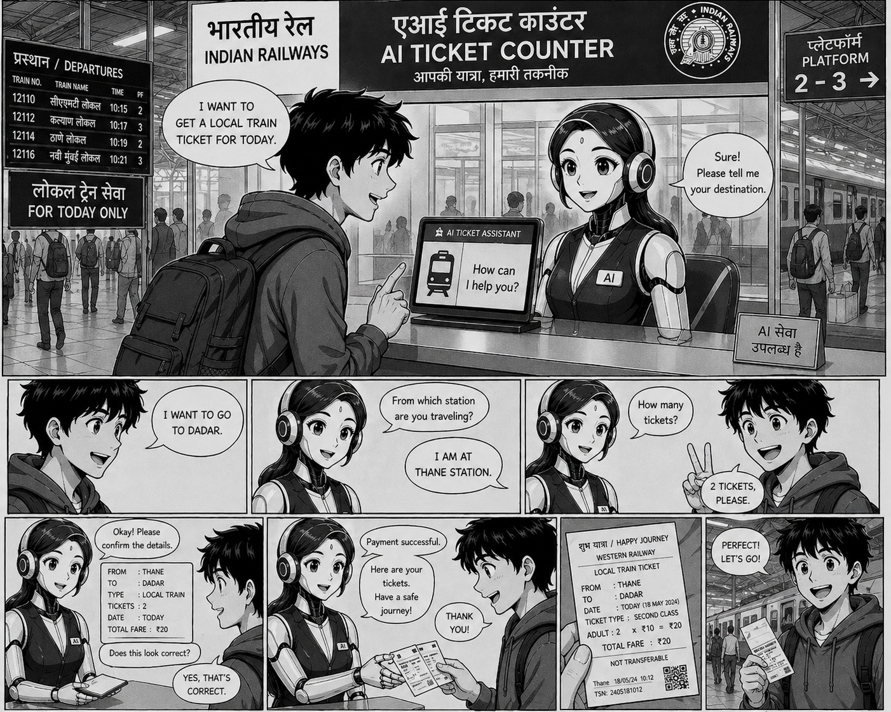
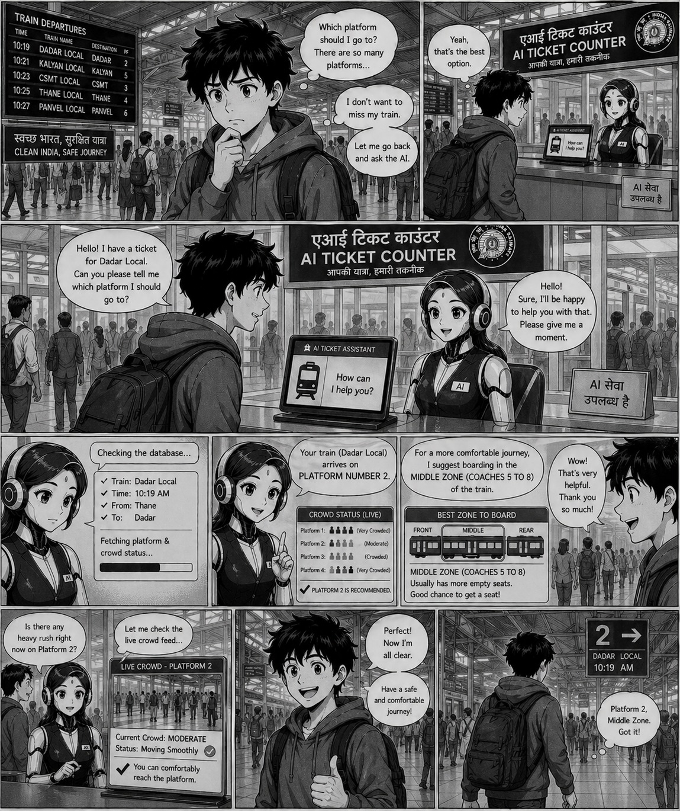
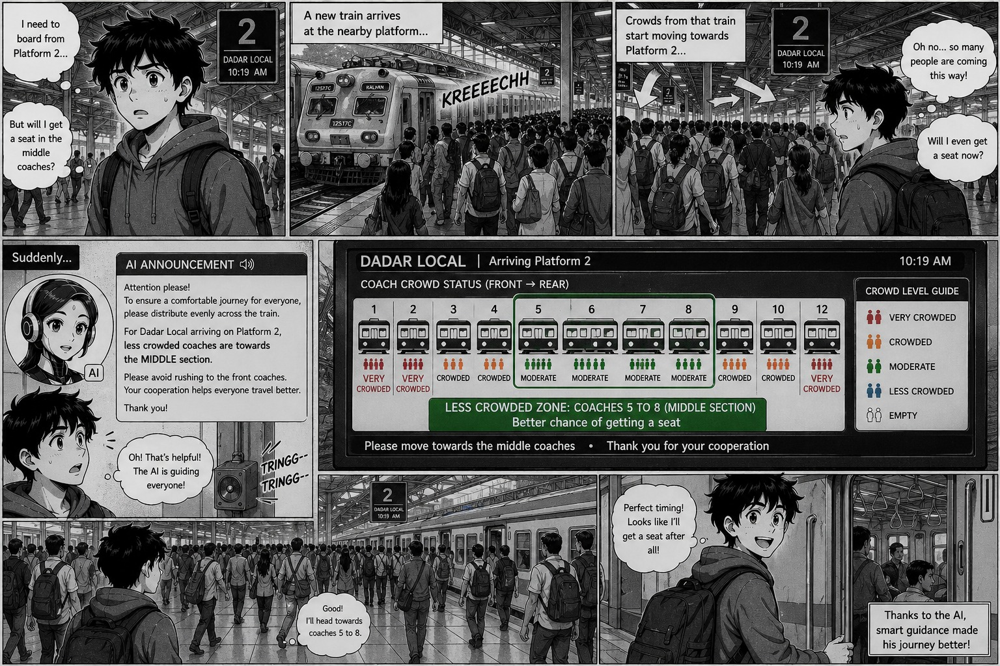

<div align="center">


<h1>
  <span style="color:#0866FF">🚇 MetroCrowdManager</span>
  <br/>
  <sub><i>Teaching LLMs to run a metro station — one tool call at a time</i></sub>
</h1>

<p>
  <b>An agentic OpenEnv submission for the Scaler × Hugging Face × Meta Hackathon</b>
</p>

</div>

---

## 🌆 The 9 PM at Hauz Khas

The idea for this Scaler Hackathon started at a metro station.

I was running late for a flight and trying to board the **Magenta Line** at **Hauz Khas** during peak evening hours. The platform was so packed there was barely room to stand. I missed one train. As I waited for the next, I noticed a display showing the **percentage of crowd occupancy** in the approaching train.

But that information was useless to me.

If I moved from where I was standing, would I find a less crowded zone elsewhere on the platform? Would the coach in front of me be empty, or would the one two zones down be better? I had no way to know. I just stared at that board, helpless and frustrated, watching another train slide in too full to board.

The following week, my friend **Giridaran** and I learned about the **Scaler OpenEnv Hackathon**. We knew immediately what we wanted to build: an environment to train models that don't just *display* crowd data — they **act on it**, communicating with passengers from the moment a ticket is issued all the way through to in-station announcements.

Personally, I wish Delhi Metro had this feature that day.

---

## 🧠 What we built

We developed an **end-to-end agentic environment** that handles the full passenger journey:

1. **Ticket booking** — the agent converses with the passenger, validates the destination, quotes a fare, and runs the payment loop.
2. **Ticket issuance** — the agent fetches live platform and train crowd state, then issues a structured ticket that includes an **ideal boarding zone** for that specific passenger.
3. **Crowd announcement** — across multiple train arrivals, the agent reads platform and train crowd distributions and produces redirection announcements that nudge passengers from packed zones into emptier ones.

The environment is built on top of [**Meta's OpenEnv**](https://github.com/meta-pytorch/OpenEnv) and exposes everything through the **MCP (Model Context Protocol)** tool surface, so the same agent we train in simulation can be plugged into real metro infrastructure with sensor-driven MCP servers swapped in.

<div align="center">

| <span style="color:#FFD21E">🤗 Hugging Face</span> | <span style="color:#0866FF">🅼 Meta</span> | <span style="color:#FF9D00">⚡ Scaler</span> |
|:---:|:---:|:---:|
| Trackio dashboards, HF Jobs training, Spaces hosting | OpenEnv + `MCPEnvironment` foundation | Hackathon, problem framing, the spark |

</div>

---

## 🛠️ Approach: tools all the way down

Rather than letting the model hallucinate fares, platform numbers, or crowd states, we forced **every fact** to come from a tool call. We built **11 MCP tools** in our environment, and the model is rewarded for calling them in the right order, piping their outputs into each other, and using their results faithfully in the final answer.

This **tools-first** design has a deliberate consequence: **a model trained in our simulator can be deployed unchanged in the real world**. The simulated MCP tools (which serve mock crowd data) get swapped for real MCP tools backed by station sensors and CCTV-derived occupancy estimates. The agent doesn't know — and doesn't need to know — the difference.

> <span style="color:#0866FF"><b>Design principle:</b></span> rewards are grounded in <i>what the agent did</i> (tool calls + their results), not in surface text. No LLM-as-judge. Every reward function is a deterministic heuristic.

---

## 📋 The three tasks

### <span style="color:#FF9D00">🎫 Task 1 — Ticket Booking</span>

The model is trained to **converse** with a passenger and gather everything required to book a ticket: destination, passenger count, fare confirmation, and finally a clean payment loop. The episode runs until the payment resolves and the outcome is communicated back to the passenger.

**Example trajectory**

> 👤 *Passenger:* "Hi, I need a ticket."
> 🤖 *Agent:* "Of course! Where would you like to travel today, and how many passengers?"
> 👤 *Passenger:* "Three of us, going to Rajiv Chowk."
> 🤖 *Agent (tool calls):* `validate_destination("Rajiv Chowk")` → `get_ticket_cost(..., passenger_count=3)` → quote fare → `initiate_payment(...)` → poll `check_payment_status` until terminal → confirm booking.

#### Tools used

| Tool | Why the agent calls it |
|---|---|
| `list_valid_stations()` | Discovers the network — used early so the agent has the canonical station list |
| `validate_destination(destination)` | Confirms (with fuzzy matching) that what the passenger said is a real station |
| `get_ticket_cost(source, destination, passenger_count)` | Quotes a fare in INR — must be called *with the right passenger count* |
| `initiate_payment(amount, passenger_count)` | Kicks off a payment, returns a `payment_id` |
| `check_payment_status(payment_id)` | Polls the payment — resolves to `success` or `failed` after a few ticks (~12% failure rate, baked in at scenario creation) |

#### Reward functions

We score this task on **10 dimensions** so the agent learns the *whole* booking experience, not just the happy path:

- **`task_success` (30%)** — end-to-end correctness: did `validate_destination` match the goal? Was `get_ticket_cost` called with correct args? Did `initiate_payment` use the quoted cost? Did the polling reach a terminal state? Was the outcome communicated?
- **`conversation_quality` (20%)** — was the dialogue useful and orderly? Did the agent ask for passenger count *before* initiating payment? Was the fare explained? No redundant "where are you going?" questions when the passenger already said.
- **`tool_sequence` (10%)** — fraction of expected ordered checkpoints (`list_valid_stations` → `validate_destination` → `get_ticket_cost` → `initiate_payment` → `check_payment_status`) that the agent hit *in order*.
- **`tool_fidelity` (10%)** — did the agent pipe real outputs into downstream calls? E.g. `get_ticket_cost.cost` → `initiate_payment.amount`, `initiate_payment.payment_id` → `check_payment_status.payment_id`.
- **`turn_efficiency` (10%)** — concise episodes win; looping or repeating turns gets penalized.
- **`payment_discipline` (10%)** — clear final outcome communication + sane polling cadence (not 0 polls, not >8).
- **`tool_economy` (3%)** — penalizes runaway tool spam, especially `check_payment_status` polling beyond 8 calls.
- **`politeness` (3%)** — looks for polite markers ("please", "kindly", "we appreciate") and penalizes rude phrasing or excessive `!` usage.
- **`format` (2%)** — fraction of turns that are well-formed `<tool_call>` JSON or clean final answers.
- **`clarity` (2%)** — short sentences, no jargon, good structure.

<div align="center">



<sub><i>📸 <b>Task 1 storyboard.</b> The agent walks the passenger through destination, source station, ticket count, fare confirmation, payment, and the final printed ticket — all driven by the MCP tool chain.</i></sub>

</div>

---

### <span style="color:#FF9D00">📄 Task 2 — Ticket Issuance</span>

The model receives the booking details and must **fill in a structured JSON ticket**. The crucial twist: the ticket must include an `ideal_zone` — the platform zone with the most free coach capacity, derived from live platform and train crowd state.

**Example output**

```json
{
  "time": "18:42",
  "from": "Hauz Khas",
  "to": "Rajiv Chowk",
  "price": 60,
  "platform": 3,
  "ideal_zone": "G"
}
```

To produce that `"ideal_zone": "G"`, the agent has to (1) look up the platform for the destination, (2) read both the platform crowd distribution *and* the approaching train's coach occupancy, and (3) reason about which zone has the most absorption capacity for a single passenger.

#### Tools used

| Tool | Why the agent calls it |
|---|---|
| `get_platform_for_destination(destination)` | Resolves the destination to a platform number |
| `get_platform_crowd(platform)` | Returns per-zone platform crowd % across 10 zones (A–J) |
| `get_train_crowd_occupation(platform)` | Returns per-coach occupancy % for the train at that platform |
| `get_ideal_zone(platform)` | Fuses platform + train state and recommends the single best zone |
| `get_current_time()` | Stamps the ticket |

#### Reward functions

- **`ticket_schema_validity`** — is the submission a parseable JSON object with all six required fields (`time`, `from`, `to`, `price`, `platform`, `ideal_zone`)? Do the values match the per-episode ground truth (correct platform for destination, correct fare for source/dest/passenger count, valid zone letter A–J, current scenario time)?
- **`tool_sequence`** — five-checkpoint chain: `get_platform_for_destination` → (platform_crowd ∨ train_crowd_occupation) twice → `get_ideal_zone` → `get_current_time`.
- **`tool_fidelity`** — did the platform number returned by `get_platform_for_destination` actually flow into the `platform=` argument of every downstream tool? This is the single biggest "is the agent really using its tools" signal in this task.
- **`tool_economy`** — five-call expected minimum; padding the trajectory with redundant calls drops the score.
- **`format`** — final-turn JSON without stray `<tool_call>` markup.

<div align="center">



<sub><i>📸 <b>Task 2 storyboard.</b> The agent looks up the platform, reads live crowd status across all coaches, derives the ideal middle-zone recommendation, and hands the passenger a ticket with the best zone to board.</i></sub>

</div>

---

### <span style="color:#FF9D00">📢 Task 3 — Crowd Announcement</span>

This is the task that started the whole project. Across **3–4 consecutive train arrivals**, the agent reads the current platform and train crowd state, computes the **ideal redistribution** of passengers across the 10 platform zones, and emits an **announcement** that nudges crowds from packed zones into emptier ones — specifically referencing the zone letters and using sequential, polite phrasing.

**Example output**

> 🔊 *"Attention passengers on Platform 3. For your comfort, we kindly request passengers in Zones C and D to move towards Zones G and H, where Coach G has more space. First please proceed to Zone F, then continue to Zone G if needed. Thank you for your cooperation."*
>
> **Recommended Platform Distribution:** [40, 45, 35, 30, 50, 60, 75, 70, 55, 40]
> **Platform Zone Color Codes:** [#008000, #FFFF00, #008000, #008000, #FFFF00, #FFFF00, #FF8C00, #FFFF00, #FFFF00, #008000]
> **Train Coach Color Codes:** [#FF8C00, #FF0000, #FFFF00, #008000, #FFFF00, #FF8C00, #008000, #008000, #FFFF00, #FFFF00]

#### Tools used

| Tool | Why the agent calls it |
|---|---|
| `get_platform_crowd(platform)` | Reads the 10-zone platform distribution before each arrival |
| `get_train_crowd_occupation(platform)` | Reads the per-coach occupancy of the approaching train |
| `get_ideal_distribution(platform)` | Returns the capacity-weighted target distribution across all 10 zones |

The agent must call these at *each* train arrival — the crowd state evolves between arrivals, and yesterday's announcement is wrong for today's train.

#### Reward functions

This task carries the densest reward stack — **9 dimensions** scoring different facets of a good announcement:

- **`distribution_accuracy`** — MAE between the agent's `Recommended Platform Distribution` and the algorithmically-computed ideal (capacity-weighted with iterative cap redistribution at 100%).
- **`conservation_accuracy`** — does the proposed distribution preserve total platform crowd? You can't make passengers vanish.
- **`feasibility_accuracy`** — are all proposed zone values in the valid `[0, 100]` range?
- **`color_grading`** — does the agent emit correct hex color codes for both platform zones and train coaches? The bands are: green `#008000` (≤40%), yellow `#FFFF00` (≤60%), orange `#FF8C00` (≤80%), red `#FF0000` (>80%).
- **`noop_detection`** — when the platform *is* already balanced, the agent should say so ("already balanced", "no movement needed") instead of fabricating a redirection. When it's *not* balanced, the agent must give a directive.
- **`sequential_direction`** — instructions should reference zones in order and use sequential transition words ("first… then… next"). Saying "everyone move simultaneously" gets penalized — that's how you create a stampede.
- **`factual_accuracy`** — when the announcement claims "Coach C is crowded", is `train_crowd[C] >= 60`? When it says "Coach G has space", is `train_crowd[G] <= 50`?
- **`platform_mention`** — does the announcement actually name the right platform number?
- **`language_consistency`** — English-only output (no transliterated Hindi or other scripts mixed in).
- **`politeness` + `clarity`** — same as Task 1, applied to the announcement text.

Plus the orchestration rewards (`tool_sequence`, `tool_fidelity`, `tool_economy`, `format`) shared across all three tasks.

<div align="center">



<sub><i>📸 <b>Task 3 storyboard.</b> A new train arrives, the agent reads per-coach crowd status, identifies the less-crowded middle section, and broadcasts a polite, sequential announcement that redirects passengers from the crowded ends toward Coaches 5–8.</i></sub>

</div>

---

## 🌟 Why this matters

Every metro system in the world has the *raw signal* — sensors know how crowded each platform zone is, CCTV-driven occupancy estimates know how full each coach is. What's missing is the **agent layer** that turns those signals into a useful nudge for the passenger standing on the platform.

By training in a simulator that exposes the same MCP tool surface a real station would, **the agent we're training is genuinely deployable**. Plug in real sensors, the agent doesn't notice the difference.

We believe metro and train stations with heavy crowd loads can be managed substantially better — and that passengers can have a more **informed and comfortable** journey — once an agent is in the loop, talking to them from ticket purchase all the way through to platform arrival.

The board at Hauz Khas told me the train was full. **The next board will tell me where to stand.**

---

<div align="center">

### Built with 💛 for the Scaler × <span style="color:#FFD21E">Hugging Face</span> × <span style="color:#0866FF">Meta</span> OpenEnv Hackathon

<sub>by <b>Giridaran D</b> & <b>Dhiwakar Nagarajan</b></sub>

<br/>

<a href="https://github.com/Dhiwakar1997/gluon_openenv">
  
</a>
<a href="https://huggingface.co/spaces/DhiwakarDev/mcm-trackio">
  
</a>
<a href="https://github.com/meta-pytorch/OpenEnv">
  
</a>

</div>
