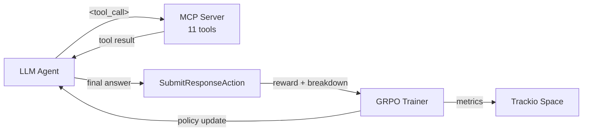
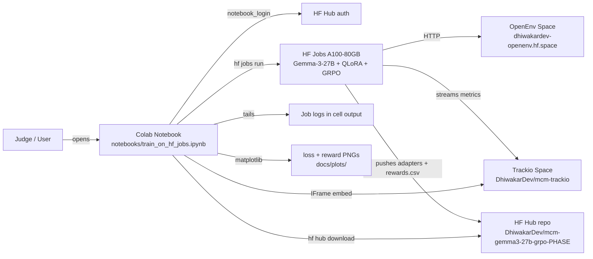
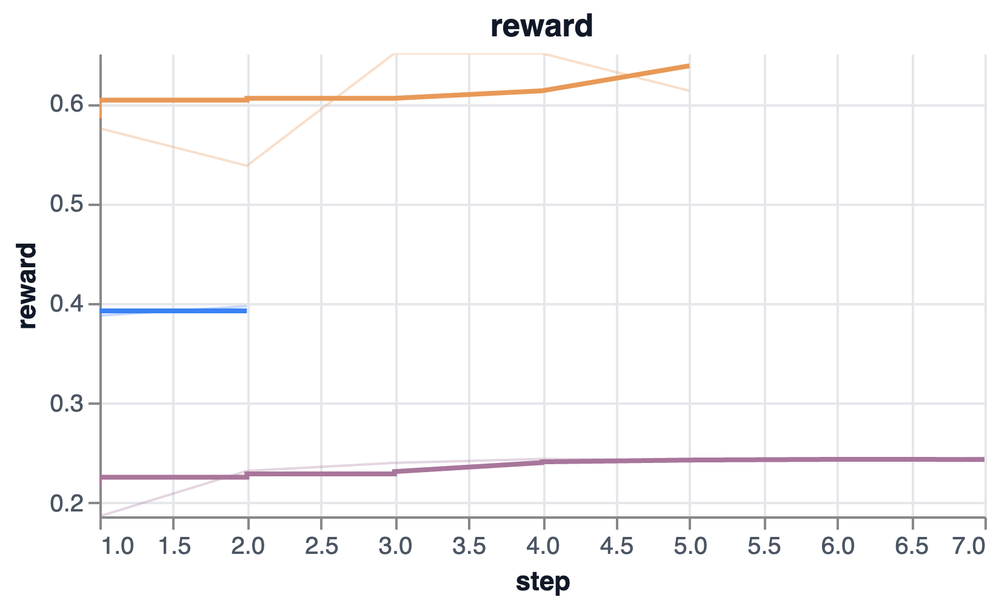
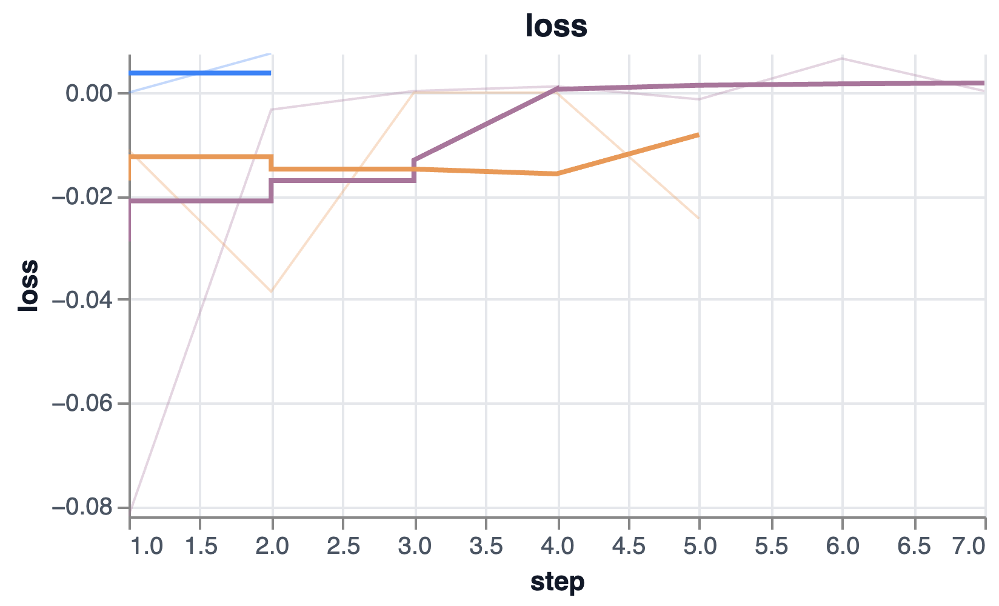

# MetroCrowdManager — Agentic MCP Environment for OpenEnv

> Hackathon submission for the OpenEnv RL Hackathon. An agentic, tool-use
> heavy environment in which an LLM plays a metro-station assistant —
> conversing with passengers, looking up live platform/crowd state, running
> payment loops, and producing crowd redirection announcements — entirely
> through MCP tool calls.

[](https://huggingface.co/spaces/DhiwakarDev/openenv)
[](https://colab.research.google.com/github/Dhiwakar1997/gluon_openenv/blob/main/notebooks/train_on_hf_jobs.ipynb)
[](https://huggingface.co/spaces/DhiwakarDev/mcm-trackio)
[](https://github.com/Dhiwakar1997/gluon_openenv)

---

## TL;DR for judges — hackathon non-negotiables checklist

Every required deliverable is linked here directly so nothing has to be hunted for.

| # | Hackathon requirement | Status | Where to find it |
|---|---|:---:|---|
| 1 | Built on **OpenEnv** (latest release) | ✅ | [`MetroCrowdManager/server/MetroCrowdManager_environment.py`](MetroCrowdManager/server/MetroCrowdManager_environment.py) — subclasses `openenv.core.env_server.mcp_environment.MCPEnvironment` |
| 2 | Working training script with an RL framework | ✅ | **Hugging Face TRL** (GRPO) — [`training/hf_jobs_train_grpo.py`](training/hf_jobs_train_grpo.py) |
| 3 | Colab notebook judges can re-run | ✅ | [`notebooks/train_on_hf_jobs.ipynb`](notebooks/train_on_hf_jobs.ipynb) — submits the run to HF Jobs A100, tails logs, embeds the live Trackio dashboard, plots loss + reward inline |
| 4 | Evidence of a real training run (loss + reward plots) | ✅ | See [Results](#results) — committed PNGs at [`MetroCrowdManager/images/`](MetroCrowdManager/images/) and live curves on the [Trackio dashboard](https://huggingface.co/spaces/DhiwakarDev/mcm-trackio) |
| 5 | Environment pushed to a **Hugging Face Space** | ✅ | <https://huggingface.co/spaces/DhiwakarDev/openenv> |
| 6 | Mini-blog or <2 min video | ✅ | Mini-blog (full story behind the project): [`MetroCrowdManager/blog.md`](MetroCrowdManager/blog.md) |
| 7 | README that motivates, explains, and shows results | ✅ | This file (you're reading it) + the env-level [`MetroCrowdManager/README.md`](MetroCrowdManager/README.md) |
| 8 | README links to HF Space + all materials | ✅ | All linked in this section and in [Submission materials](#submission-materials) below |
| 9 | Experiment tracking | ✅ | Every run streams to the [Trackio Space](https://huggingface.co/spaces/DhiwakarDev/mcm-trackio) via TRL's `TrackioCallback` |

---

## Submission materials

A single place where every external resource lives, per the hackathon brief.

| Resource | Link |
|---|---|
| 🤗 **Hugging Face Space (the environment)** | <https://huggingface.co/spaces/DhiwakarDev/openenv> |
| 📓 **Colab notebook (re-runnable training)** | [Open in Colab](https://colab.research.google.com/github/Dhiwakar1997/gluon_openenv/blob/main/notebooks/train_on_hf_jobs.ipynb) · [view on GitHub](notebooks/train_on_hf_jobs.ipynb) |
| 📈 **Trackio dashboard (live training metrics)** | <https://huggingface.co/spaces/DhiwakarDev/mcm-trackio> |
| 📝 **Mini-blog (project story + reward design walkthrough)** | [`MetroCrowdManager/blog.md`](MetroCrowdManager/blog.md) |
| 🐙 **GitHub repo (source of truth)** | <https://github.com/Dhiwakar1997/gluon_openenv> |
| 📦 **Trained adapter weights (per task)** | [`DhiwakarDev/mcm-gemma3-27b-grpo-<phase>`](https://huggingface.co/DhiwakarDev) on HF Hub |
| 📚 **Env-level README (tools + reward design)** | [`MetroCrowdManager/README.md`](MetroCrowdManager/README.md) |

---

## Motivation

Metro stations are one of the most concrete real-world settings where small
amounts of guidance produce huge throughput wins: passengers cluster near
platform entrances, train coaches load unevenly, and a single coherent
announcement can reshape boarding patterns within seconds. Existing announcement
systems are static; they don't see live crowd state and can't distinguish
"comfortable" from "crisis-level".

**MetroCrowdManager** turns that into an agentic RL setting. The agent doesn't
get a textbook problem statement — it gets the same affordances a human station
master has: a passenger walks up and asks something, MCP tools to look up
platform numbers / fares / crowd levels, a payment system to drive, and a
ticking clock. Every reward dimension is grounded in real tool outputs, not
hallucinated text, so the only way to climb the reward curve is to actually
**use the tools correctly in the right order**.



---

## What's in the env

Three tasks share the same simulated metro network and the same 11 MCP tools.

| Task | Difficulty | Episode shape | What the agent must do |
|------|------------|---------------|------------------------|
| `ticket_booking` | hard | multi-turn dialogue | Converse with a scripted passenger, validate destination, quote fare, run the payment polling loop, communicate the outcome |
| `ticket_issuance` | medium | single-turn | Use tools to gather platform + crowd intel, then emit a structured JSON ticket with the ideal boarding zone |
| `crowd_announcement` | hard | 3–4 train arrivals | Each arrival: fetch crowd state via tools and produce a redirection announcement |

The tool catalog and reward breakdowns are documented in detail in
[`MetroCrowdManager/README.md`](MetroCrowdManager/README.md). Highlights:

- **11 MCP tools** (FastMCP under the hood) for station info, fare quoting,
  payment, crowd lookup, ideal-zone recommendation.
- **3 task-specific reward functions** combining 10 orchestration rewards
  ([`MetroCrowdManager/server/agentic_rewards.py`](MetroCrowdManager/server/agentic_rewards.py))
  with 11 text/crowd-accuracy rewards
  ([`MetroCrowdManager/server/rewards.py`](MetroCrowdManager/server/rewards.py)).
- **Anti-gaming guards**: zero-tool-call floor on `ticket_issuance`, malformed
  `<tool_call>` tag detection, premature-payment penalties.

---

## Architecture of the training run



The training loop is real GRPO with TRL: vLLM-free rollout via the agentic
loop in [`training/agentic_rollout_func.py`](training/agentic_rollout_func.py),
4-bit QLoRA on `google/gemma-3-27b-it`, and a custom remote reward function in
[`training/hf_jobs_train_grpo.py`](training/hf_jobs_train_grpo.py) that
re-submits each completion to the live OpenEnv Space and reads back the
per-task reward breakdown.

---

## Reproduce

### Option A — Re-run the training in Colab (recommended for judges)

1. Open the notebook: [`notebooks/train_on_hf_jobs.ipynb`](notebooks/train_on_hf_jobs.ipynb)
   ([Open in Colab](https://colab.research.google.com/github/Dhiwakar1997/gluon_openenv/blob/main/notebooks/train_on_hf_jobs.ipynb)).
2. Run the **Setup** + **Auth** cells (calls `notebook_login()`). You need
   an `HF_TOKEN` with `write` scope.
3. Pick the phase (`ticket_booking` / `ticket_issuance` / `crowd_announcement`),
   model, step count, and HF Jobs flavor in the **Parameters** cell.
4. Hit **Run All**. The notebook will:
   - submit the job via `hf jobs run` (A100-80GB, ~$),
   - tail the live logs into the cell output,
   - embed the [Trackio dashboard](https://huggingface.co/spaces/DhiwakarDev/mcm-trackio) iframe,
   - at end-of-run download `rewards.csv` from the Hub repo and render loss + reward PNGs inline.

> Don't have HF Jobs billing? The saved cell outputs in the committed `.ipynb`
> show all of the above for the most recent production run; you can also click
> straight through to the [Trackio dashboard](https://huggingface.co/spaces/DhiwakarDev/mcm-trackio).

### Option B — Run the env locally and try inference

```bash
cd MetroCrowdManager
uv sync
uv run server                       # FastAPI on http://localhost:8000

# in another shell
export HF_TOKEN="your-token"
export API_BASE_URL="https://router.huggingface.co/v1"
export MODEL_NAME="google/gemma-3-27b-it"
python inference.py
```

### Option C — Submit the HF Jobs run from the CLI (no Colab)

```bash
export HF_TOKEN="your-token"
bash scripts/full_run_hf_job.sh ticket_issuance
# or for all three tasks sequentially:
bash scripts/full_run_hf_job.sh ALL
```

See [`scripts/full_run_hf_job.sh`](scripts/full_run_hf_job.sh) for tunable
defaults (model, steps, batch, flavor, timeout).

### Option D — Update the public HF Space (env repo + README)

The Space is built and uploaded by `openenv push`. If the README on the Space
looks stale (Spaces caches the file on their side), re-run the helper:

```bash
export HF_TOKEN="your-token"
bash scripts/push_env_to_hf_space.sh
# Or force-overwrite just the README:
FORCE_README=1 bash scripts/push_env_to_hf_space.sh
```

The script is a thin wrapper around `openenv push` ([`scripts/push_env_to_hf_space.sh`](scripts/push_env_to_hf_space.sh))
that also offers a `huggingface-cli` fallback to overwrite the Space's
`README.md` directly when needed.

---

## Results

Real GRPO run on Hugging Face Jobs A100-80GB. Live, always-current metrics:
[**Trackio dashboard**](https://huggingface.co/spaces/DhiwakarDev/mcm-trackio).

### Reward + loss curves (from the latest Colab run)

Live, per-step training metrics for every run are streamed to the
[**Trackio dashboard**](https://huggingface.co/spaces/DhiwakarDev/mcm-trackio).
Two snapshots from a representative GRPO run on **`google/gemma-3-27b-it`**:

<div align="center">



<sub><i>📈 <b>Reward / mean across runs.</b> Higher is better. Each line is a different task — the orange (booking) curve climbs from <code>0.60 → 0.64</code>, the purple (announcement) curve from <code>~0.19 → ~0.24</code>, and the blue (issuance) curve starts higher because of how its reward weights collapse onto schema validity.</i></sub>

</div>

<div align="center">



<sub><i>📉 <b>Train / loss across runs.</b> The big dive at step 1 is the model rapidly discovering the <code>&lt;tool_call&gt;</code> JSON pattern; subsequent steps stabilise around zero as the policy converges.</i></sub>

</div>

Full narrative + per-task reward breakdown lives in the env-level
[`MetroCrowdManager/README.md`](MetroCrowdManager/README.md#what-the-training-curves-tell-us).

### Scores from the latest run

The notebook prints the final-step mean reward per task; commit those into
the table below after each run so the README stays in sync with the plots.

| Task | Model | Mean reward (final step) |
|------|-------|--------------------------|
| `ticket_booking` | Gemma-3-27B + LoRA | _filled from latest Colab run_ |
| `ticket_issuance` | Gemma-3-27B + LoRA | _filled from latest Colab run_ |
| `crowd_announcement` | Gemma-3-27B + LoRA | _filled from latest Colab run_ |

Adapter weights and the run's `rewards.csv` + `log_history.json` are pushed to
[`DhiwakarDev/mcm-gemma3-27b-grpo-<phase>`](https://huggingface.co/DhiwakarDev)
at end-of-training.

---

## Mini-blog / video

The full story behind MetroCrowdManager — the missed train at Hauz Khas, the
three-task design, the tool catalog, the reward shaping decisions, and what
the training curves taught us — is written up as a mini-blog inside the repo:

> 📝 **[Read the mini-blog → `MetroCrowdManager/blog.md`](MetroCrowdManager/blog.md)**

The blog is also rendered on the [Hugging Face Space](https://huggingface.co/spaces/DhiwakarDev/openenv)
landing page (linked from the env-facing README banner).

---

## Repo layout

```
.
├── README.md                     # This file (hackathon submission entrypoint)
├── MetroCrowdManager/            # The OpenEnv environment package (gets pushed as the HF Space)
│   ├── README.md                 # Space-facing README (env API + tool docs + results)
│   ├── blog.md                   # Mini-blog: project story + reward design walkthrough
│   ├── openenv.yaml              # Manifest with task + tool spec
│   ├── server/                   # FastAPI + FastMCP env server
│   ├── client.py                 # Async client used by training + inference
│   ├── inference.py              # Baseline agentic-loop inference
│   ├── images/                   # Committed loss + reward PNGs (referenced from both READMEs)
│   └── ...
├── training/
│   ├── hf_jobs_train_grpo.py     # GRPO training script run on HF Jobs A100
│   ├── agentic_rollout_func.py   # Agentic rollout for TRL's GRPOTrainer
│   ├── rollout.py                # Single-episode agentic loop (canonical)
│   └── ...
├── notebooks/
│   └── train_on_hf_jobs.ipynb    # Colab notebook: launches HF Jobs + plots
├── scripts/
│   ├── full_run_hf_job.sh        # CLI entrypoint to submit HF Jobs A100 runs
│   ├── smoke_hf_job.sh           # Short smoke run for plumbing checks
│   └── test_rollout.py           # Local rollout sanity test
├── docs/plots/                   # Optional dump dir for notebook-regenerated PNGs
└── outputs/                      # Local training artifacts (rewards.csv, adapters)
```

---

## License

This project is licensed under the BSD-3-Clause license (inherited from the
OpenEnv core dependency). See individual file headers for details.

## Authors

Giridaran D, Dhiwakar Nagarajan
